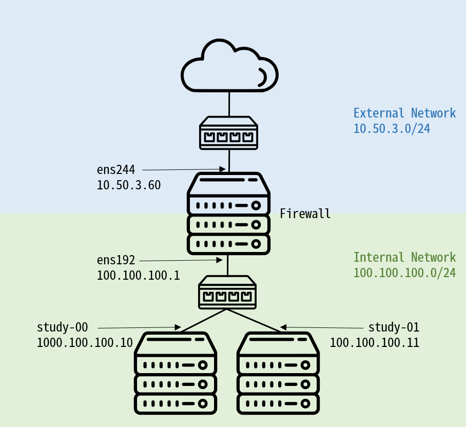

# Ansible Tower TEST Project

### LAB
| hostname    | IP     | description    | OS|
| :-------------: | :-------------: | :-------------: | :-------------: |
| study-99       | 10.50.3.60       | Firewall, YUM Repository, DNS, NTP      ||RHEL 7.8
| study-00       | 100.100.100.10      | Ansible Tower, Gitlab       | RHEL 7.8|
| study-01       | 100.100.100.11       | Ansible Manage Node       |RHEL 7.8|
| study-02      | 100.100.100.12       |  Ansible Manage Node      |Windows Server|
